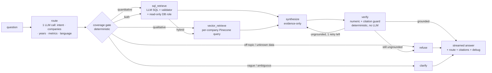

# Financial Q&A Chatbot

A locally-run Q&A chatbot that answers financial questions about U.S. public
companies, grounded in two data sources:

- **SQL (PostgreSQL)** — structured income-statement financials (~48 companies, 2022–2025).
- **Vector DB (Pinecone local)** — chunked/embedded text from four FY2025 10-K filings
  (Alphabet, Amazon, Apple, Meta).

**Hard requirement: no hallucination.** If the data needed to answer a question isn't
available (a company with no 10-K indexed, a year outside 2022–2025, an unknown
company), the assistant says so explicitly instead of inventing an answer. Questions
work in whatever language they're asked in (the baseline questions are Thai).

Full assignment spec: `Take-Home Task.pdf` (repo root). Design rationale and the
day-by-day build log live in [`docs/`](docs/) — `docs/implementation-plan.md` (strategy)
and `docs/technical-execution-plan.md` (code-level contracts).

## Architecture



- **route**: one structured-output LLM call classifies intent (financial / off-topic /
  vague), normalizes company mentions to canonical names using the model's own world
  knowledge (Facebook → Meta, Alphabet → Google, "the iPhone maker" → Apple), and
  proposes a route.
- **coverage gate** (`backend/app/agent/coverage.py`): pure Python, no LLM. The last
  line of defense against hallucination — even a well-behaved router can't route
  around data that doesn't exist. Downgrades routes and attaches coverage notes (e.g.
  "Microsoft has no 10-K indexed — its 'why' can't be grounded").
- **sql_retrieve**: an LLM writes one SQL query, validated by `sqlglot` (single
  `SELECT`, only `financial_data`, capped `LIMIT`) and executed via a Postgres role
  (`agent_ro`) that can only `SELECT` from `financial_data` — it physically cannot
  read the `users` table. Growth percentages are computed in Python, never by the LLM.
- **vector_retrieve**: queries Pinecone once per company (never a single global top-k —
  per-company chunk counts are heavily skewed). Rejects chunks below a score floor,
  print-to-PDF header-noise chunks, and near-duplicate chunks (the provided dataset
  contains most real chunks twice under different ids — see "Known data quirks" below).
  The dense Pinecone ranking is fused with a lexical Postgres full-text ranking via
  reciprocal rank fusion before these filters run — see "Hybrid retrieval" below.
- **synthesize**: strict evidence-only contract (structured output) — quantitative
  claims only from SQL/computed figures, qualitative claims cited `[Source, p.N]`,
  coverage gaps stated explicitly in the answer text, answer language set explicitly
  from the router's detection (not re-inferred from prose).
- **verify**: deterministic, no LLM. Extracts every number in the draft answer and
  checks it's grounded in the retrieved evidence, and separately extracts every
  `[Source, p.N]` citation marker and checks it resolves to a chunk that was
  actually retrieved (a marker pointing at a source/page never retrieved is
  "dangling"). One retry on either kind of failure, then a fail-closed refusal —
  the draft is discarded, never annotated.
- Auth (JWT + bcrypt) and the streaming transport (SSE, AI SDK UI message stream
  protocol) are deliberately decoupled from the agent internals, kept simple to extend
  in a follow-up session.

## Prerequisites

- [Docker Desktop](https://www.docker.com/products/docker-desktop/) (Compose v2+)
- [uv](https://docs.astral.sh/uv/) (Python 3.12+ project/dependency manager)
- Node.js 20+ and npm
- An OpenAI API key (a small $10-budget key is fine — the app costs well under $2 for
  the full baseline + eval run at `gpt-4o-mini` prices)

Versions this was built and verified against: Docker Compose v5, uv 0.11, Node 24,
npm 11. Nothing here is version-pinned tightly; anything reasonably recent should work.

## Setup

### 1. Configure environment variables

```bash
cp .env.example .env
```

Edit `.env` and set `OPENAI_API_KEY`. Everything else in `.env.example` has a working
local-dev default — see [Environment variables](#environment-variables) below for what
each one does. `.env` is gitignored; never commit it.

The frontend needs its own env file (also gitignored):

```bash
echo "NEXT_PUBLIC_API_URL=http://localhost:8000" > frontend/.env.local
```

### 2. Bring up the data stack

```bash
docker compose up -d
# or: make up
```

This starts three containers:

| Service | Container | Port(s) | Purpose |
|---|---|---|---|
| `postgres` | `smc-postgres` | 5432 | `financial_data` (auto-seeded via initdb mount) + `users` table |
| `pinecone` | `smc-pinecone` | 5080–5090 | pinecone-local (control plane 5080; each index gets a data-plane port in 5081–5090) |
| `adminer` | `smc-adminer` | 8080 | optional DB browser UI — `http://localhost:8080`, server `postgres`, user `app`, password `app_local_dev`, database `findata` |

Postgres seeds itself automatically on first volume creation (`data/financial_data.sql`
+ `scripts/initdb/02_chunk_text.sql` + `scripts/initdb/03_roles.sql` mount into
`/docker-entrypoint-initdb.d/`). **Pinecone does not** — see the caveat below.

> **Upgrading an existing clone**: if your Postgres volume was created before hybrid
> retrieval was added, it won't have the `chunk_text` table (initdb only runs on a
> *fresh* volume). Run `docker compose down -v && docker compose up -d` once to pick
> it up — the app still works without it (retrieval degrades to dense-only) but full
> hybrid retrieval needs the fresh volume + the loader in step 3 below.

### 3. Seed the vector store and full-text index

```bash
uv run --project backend python scripts/load_pinecone.py
uv run --project backend python scripts/load_chunk_text.py
# or: make seed
```

`load_pinecone.py` loads `data/pinecone_vectors.jsonl.gz` (pre-chunked, pre-embedded
10-K text) into Pinecone. `load_chunk_text.py` loads the *same* source file's chunk
text into Postgres' `chunk_text` table — the lexical half of hybrid retrieval (see
below), sharing ids with the Pinecone vectors. Both are idempotent — safe to re-run —
and both assert their store ends up with exactly 4072 records, failing loudly
otherwise.

> **⚠️ Seed-after-restart caveat**: `pinecone-local` has **no persistence** — its data
> lives only in the running container's memory. Any time you run `docker compose down`
> (with or without `-v`) and back `up`, or otherwise recreate the `pinecone` container,
> **you must re-run `make seed`** before the app can answer qualitative questions.
> `GET /api/health` will report `vector_count: 0` and `ok: false` if you forget.
> Postgres, by contrast, only needs its initdb scripts to re-run after `down -v`
> specifically (its named volume `pgdata_16` otherwise survives a plain `down`/`up`)
> — `make down` is deliberately `docker compose down -v` for this reason. `chunk_text`
> itself persists like the rest of Postgres, but re-running `load_chunk_text.py` is
> always safe (`ON CONFLICT DO NOTHING`).

### 4. Run the backend

```bash
cd backend
uv sync
uv run uvicorn app.main:app --reload --port 8000
# or, from repo root: make api
```

Verify it's up and both data sources are loaded:

```bash
curl http://localhost:8000/api/health
# {"postgres_rows":192,"vector_count":4072,"ok":true}
```

### 5. Run the frontend

```bash
cd frontend
npm install
npm run dev
# or, from repo root: make web
```

Open `http://localhost:3000` — you'll land on `/chat`, which redirects to `/login` if
you don't have a token yet. Register a new account, then ask a question.

## Makefile targets

Requires GNU Make. Windows users without `make` (e.g. plain PowerShell/Git Bash): use
the raw command in the right-hand column instead — they're identical to what the
target runs.

| Target | Raw command |
|---|---|
| `make up` | `docker compose up -d` |
| `make seed` | `uv run --project backend python scripts/load_pinecone.py && uv run --project backend python scripts/load_chunk_text.py` |
| `make api` | `cd backend && uv run uvicorn app.main:app --reload --port 8000` |
| `make web` | `npm --prefix frontend run dev` |
| `make test` | `cd backend && uv run pytest` |
| `make eval` | `uv run --project backend python scripts/eval_baseline.py` |
| `make down` | `docker compose down -v` |

## Testing

```bash
cd backend
uv run pytest
```

All tests run fully offline (in-memory SQLite, stubbed LLMs/Pinecone/embedders via
`create_app()`'s dependency-injection — every real client is built only when its
constructor argument is left `None`) — zero API cost, no Docker required.

## Baseline evaluation

With the backend running (step 4 above) and both data sources seeded:

```bash
uv run --project backend python scripts/eval_baseline.py
# or: make eval
```

Registers a throwaway user and drives the three baseline questions plus five
refusal/clarify probes against the real `/api/chat` SSE endpoint — end to end,
including the LLM calls, retrieval, and the streaming protocol itself. Ground-truth
growth figures are parsed from `data/financial_data.sql` at run time, never
hardcoded, so the eval can't silently drift from the shipped data. Exits non-zero if
any case fails.

## Environment variables

See `.env.example` for the full list with working defaults. The ones you're likely to
touch:

| Variable | Purpose |
|---|---|
| `OPENAI_API_KEY` | **Required, no default.** Swap to a different key if the $10 budget cap is hit — no code change needed. |
| `OPENAI_CHAT_MODEL` / `OPENAI_EMBED_MODEL` | Model names (defaults: `gpt-4o-mini`, `text-embedding-3-small`). |
| `EMBED_DIMENSIONS` | Must stay `512` — the provided vectors were embedded at this dimension; changing it breaks retrieval. |
| `DATABASE_URL` / `AGENT_RO_DATABASE_URL` | App-role vs. read-only-role Postgres connections — the agent's SQL tool only ever uses the latter. |
| `SCORE_FLOOR` / `TOP_K` | Vector retrieval tuning — chunks scoring below the floor are rejected (visible in the `debug` payload's `rejected_chunks`). `TOP_K` also governs the Postgres full-text search breadth per company and the final per-company cap after RRF fusion — see "Hybrid retrieval" below. |
| `HISTORY_MAX_MESSAGES` | How many trailing conversation messages (default 8, ≈4 exchanges) the router/synthesizer see verbatim — see "Multi-turn context" below. |
| `JWT_SECRET` | Change this for anything beyond local dev. |
| `CORS_ORIGINS` | Frontend origins allowed to call the API. |

## Multi-turn context

The router and synthesizer see the trailing `HISTORY_MAX_MESSAGES` messages of
the conversation (default 8, verbatim — no summarization), so follow-ups like
"suggest metrics for AMZN" → "Revenue. Give me insights" → "the revenue"
resolve against what was already said instead of re-asking for the company
every turn. If a request is still ambiguous even considering that history, the
router still asks a clarifying question rather than guessing — the fix widens
what counts as "enough information," it doesn't remove the no-hallucination
guard. `sql_retrieve`/`vector_retrieve` don't need history directly; by the
time they run, the router has already resolved company/year/metric into
`AgentState`.

This is intentionally a small, fixed window, not the sliding-window +
LLM-summarization pipeline you'll see in longer-running agents — see
`docs/implementation-plan.md`'s Future-improvements entry on hierarchical
summarization for why that's deferred (a financial Q&A session is a handful
of exchanges, and an extra per-turn summarization call is itself a
hallucination surface). It also doesn't survive a page reload — see the next
point.

## Hybrid retrieval

`vector_retrieve` doesn't rely on Pinecone's dense (cosine-similarity) ranking
alone. Dense embeddings under-rank exact-term matches — ticker symbols, section
labels like "Item 1A", specific product names — that are common in financial
questions but easy for a similarity search to bury under more "semantically
similar" but less relevant chunks. A second, lexical ranking runs alongside it:
Postgres full-text search (`tsvector`/`ts_rank_cd`) over the same chunk text,
loaded into a `chunk_text` table by `scripts/load_chunk_text.py` from the same
source file Pinecone is seeded from (so both stores share the same chunk ids).
The question is tokenized into an **OR-combined** query (`word1 | word2 | ...`),
not `plainto_tsquery`'s default AND — an ordinary multi-word question ANDed
together almost never matches a single chunk verbatim (verified live: it
matched zero rows), whereas OR lets a partial match surface and `ts_rank_cd`
still rewards chunks matching more of the terms.

The two rankings are fused per company with [reciprocal rank
fusion](https://plg.uwaterloo.ca/~gvcormac/cormacksigir09-rrf.pdf) (RRF) —
`score(chunk) = Σ 1/(k + rank_in_system)`, summed over whichever of the two
systems ranked it — before the existing boilerplate/score-floor/dedup filters
run. RRF combines rankings by *position*, not raw score, which matters here
because cosine similarity and `ts_rank_cd` aren't on a comparable scale. A
chunk that only one system finds still surfaces on that system's rank alone;
a chunk both systems rank well floats to the top.

This degrades gracefully, not silently: `TextSearchTool.query` catches any DB
error (most likely `chunk_text` not existing yet on a pre-hybrid Postgres
volume, see the upgrade note in step 2 above) and returns no lexical hits
rather than raising, so `HybridTool` falls back to dense-only results —
exactly the pre-hybrid behavior — instead of the whole retrieval node
crashing. There's no feature flag; hybrid retrieval is simply always wired up
and quietly no-ops if its table isn't there yet.

## Known trade-offs and data quirks

- **Auth token in `localStorage`**, checked by a client-side route guard (`useEffect`
  redirect), not middleware. Simple and sufficient for this build; refresh-token
  rotation + httpOnly cookies are natural next steps (see
  `docs/implementation-plan.md` §5) — deliberately kept simple since auth will be
  extended live in a follow-up session.
- **No persisted chat history** — conversations live only in the browser tab's
  `useChat` state (this is also what the agent's history-aware routing reads —
  see "Multi-turn context" above — so a page reload loses both the visible
  transcript and the context the router uses). See `docs/implementation-plan.md`
  §4 for the planned `messages` table and resumable-streams design.
- **Duplicate vector chunks in the provided dataset**: `data/pinecone_vectors.jsonl.gz`
  (loaded as-is, never regenerated) contains roughly half its 4072 records as
  near-duplicates of another record's text under a different id. The vector store
  still holds and reports all 4072 vectors unchanged (matching the loader's own
  assertion and `/api/health`); `VectorTool.query` dedupes by `(company, text)` at
  read time instead, keeping the highest-scoring copy of each chunk.
- **Coverage gap is intentional, not a bug**: the SQL table covers ~48 companies;
  the vector store only covers Alphabet/Amazon/Apple/Meta. Asking about a company
  with SQL data but no indexed 10-K (e.g. Microsoft) correctly answers the
  quantitative half and explicitly flags the qualitative "why" as ungroundable.
- **$10 OpenAI budget**: the full baseline + eval run costs well under $2 at
  `gpt-4o-mini` prices. If the provided key's cap is hit, swap `OPENAI_API_KEY` in
  `.env` — everything else is unaffected.

## Repo layout

```
docker-compose.yml       # postgres + pinecone-local + adminer (data stack only; apps run on host)
.env.example             # copy to .env and fill in OPENAI_API_KEY
Makefile                 # up / seed / api / web / test / eval / down
data/                    # provided: financial_data.sql (SQL dump), pinecone_vectors.jsonl.gz
10k_filings/             # provided: raw FY2025 10-K PDFs (Alphabet, Amazon, Apple, Meta)
scripts/
  initdb/                # chunk_text table + Postgres role setup (agent_ro, read-only)
  load_pinecone.py        # idempotent vector store seeder
  load_chunk_text.py      # idempotent chunk_text (full-text search) seeder -- same source file
  eval_baseline.py        # live-stack integration eval
backend/                 # FastAPI + LangGraph agent (see backend/app/)
frontend/                # Next.js + AI SDK useChat + shadcn/ui
docs/                    # design docs — source of truth for scope/architecture decisions
agent-output/            # gitignored scratch space for AI-agent-generated drafts
```
