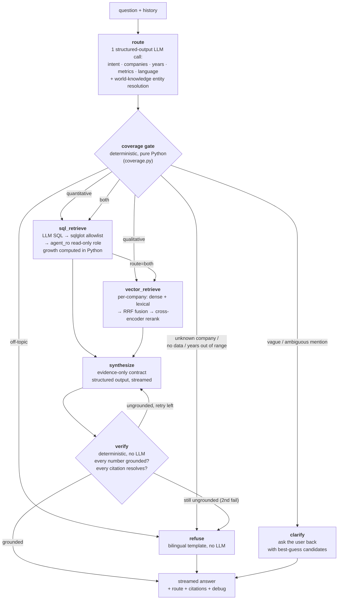

# Financial Q&A Chatbot

A locally-run, authenticated Q&A chatbot that answers financial questions about U.S.
public companies, grounded strictly in two data sources and engineered so that **it
cannot hallucinate a grounded-looking answer** — if the data isn't there, it says so.

- **SQL (PostgreSQL)** — structured income-statement financials (~48 companies, 192 rows, 2022–2025).
- **Vector DB (Pinecone local)** — 4,072 chunked/embedded excerpts from four FY2025 10-K filings
  (Alphabet, Amazon, Apple, Meta).

**Stack:** FastAPI + LangGraph + OpenAI on the backend; Next.js 16 + Vercel AI SDK
(`useChat`) + shadcn/ui on the frontend; Postgres + `pinecone-local` via Docker Compose;
custom JWT/bcrypt auth. Full assignment spec: `Take-Home Task.pdf` (repo root). Design
rationale and the day-by-day build log live in [`docs/`](docs/) —
`docs/implementation-plan.md` (strategy) and `docs/technical-execution-plan.md`
(code-level contracts), which remain the source of truth for scope decisions.

## Table of contents

- [The hard requirement: no hallucination](#the-hard-requirement-no-hallucination)
- [Baseline acceptance questions](#baseline-acceptance-questions)
- [Data coverage (and the intentional gap)](#data-coverage-and-the-intentional-gap)
- [Architecture](#architecture)
- [The layered no-hallucination defense](#the-layered-no-hallucination-defense)
- [Conversation quality](#conversation-quality)
- [Frontend UX](#frontend-ux)
- [Evaluation strategy](#evaluation-strategy)
- [Auth](#auth)
- [Setup and run](#setup-and-run)
- [Tech stack](#tech-stack)
- [Configuration surface](#configuration-surface)
- [Hybrid retrieval, reranking, and multi-turn context](#hybrid-retrieval-reranking-and-multi-turn-context)
- [Known trade-offs and data quirks](#known-trade-offs-and-data-quirks)
- [Repo layout](#repo-layout)
- [Future roadmap](#future-roadmap)

## The hard requirement: no hallucination

The entire design is organized around a single non-negotiable: when the data needed to
answer a question isn't available — a company with no indexed 10-K, a year outside
2022–2025, an unknown company, a question that isn't about company financials at all —
the assistant must **say so explicitly** rather than invent an answer. "Please don't
hallucinate" is a prompt; this project turns it into a set of mechanical gates that a
misbehaving LLM cannot route around. See [the layered defense](#the-layered-no-hallucination-defense).

Questions work in whatever language they're asked in — the three baseline questions are
in Thai; answers come back in the same language.

## Baseline acceptance questions

The three required questions from the spec, and how the agent handles each:

| # | Question | Route | Grounding |
|---|---|---|---|
| **1** | Net income summary for Apple, 2022–2025 | `sql` | SQL only. Four figures pulled from `financial_data`, no vector call. |
| **2** | Compare Google vs. Facebook revenue structure & business strategy, 2025 | `vector` | 10-K text only (qualitative). Cited excerpts from both the Alphabet and Meta filings. |
| **3** | Which of Microsoft/Apple/Google/Facebook had the highest revenue growth 2024–2025, and why | `both` | SQL for the growth numbers (computed in Python) **+** vector for the "why". **Microsoft has no 10-K in the vector store**, so its "why" is explicitly flagged as ungroundable in the answer text — the agent answers the quantitative half and refuses to fabricate the qualitative half. |

Question 3 is the sharpest test of the no-hallucination requirement: the correct answer
is *partially* groundable, and a naïve agent would happily invent a strategic narrative
for Microsoft. All three are driven end-to-end by `scripts/eval_baseline.py` against the
live streaming endpoint — see [Evaluation strategy](#evaluation-strategy).

## Data coverage (and the intentional gap)

Both stores are loaded **as provided** — never regenerated or re-embedded (see
[data quirks](#known-trade-offs-and-data-quirks)).

- **SQL** (`financial_data`): `company, ticker, sector, year, revenue, gross_profit,
  operating_income, net_income`. ~48 companies × 2022–2025, 192 rows. Some cells are NULL
  (e.g. Amazon's `gross_profit` is entirely NULL). Coverage edges are real: BlackRock only
  2022–2023, Shopify only 2024–2025.
- **Vector** (`pinecone-local`): exactly 4,072 records, 512-dim (`text-embedding-3-small`,
  cosine). Only **Alphabet, Amazon, Apple, Meta** are indexed. Per-company chunk counts are
  heavily skewed — Meta 1,568, Alphabet 1,052, Amazon 848, Apple 604 — which is why retrieval
  never uses a single global top-k (it would starve the smaller filings) and always queries
  per company.

**The coverage gap is a designed test surface, not a bug.** A company like Microsoft has
SQL figures but no indexed 10-K. The agent must recognize this and refuse to ground the
qualitative half rather than paper over it. The deterministic coverage gate
(`backend/app/agent/coverage.py`) is what makes that recognition unfoolable.

## Architecture

A LangGraph state machine (`backend/app/agent/graph.py`) wired entirely from injected
clients — no module singletons, so the whole graph can be built from stubs for offline
tests.



Node responsibilities in one line each:

- **route** (`nodes/route.py`) — one temp-0 structured-output LLM call classifies intent
  (`financial` / `off_topic` / `vague`), normalizes company mentions to canonical SQL
  names using the model's own world knowledge (Facebook → Meta, Alphabet → Google, "the
  iPhone maker" → Apple), extracts years/metrics/language, and proposes a route. History
  is threaded in so elliptical follow-ups resolve.
- **coverage gate** (`coverage.py`, invoked inside the route node) — pure Python, no LLM.
  The last line of defense: it runs *after* the router and cannot be talked out of a
  refusal. Downgrades routes, trims out-of-range years, and attaches coverage notes.
- **sql_retrieve** (`nodes/sql_retrieve.py` + `sql_tool.py`) — LLM writes one SQL query;
  it is validated by `sqlglot` and executed as a read-only Postgres role. Growth
  percentages are computed in Python (`growth.py`), never by the LLM.
- **vector_retrieve** (`nodes/vector_retrieve.py`) — per-company dense retrieval fused with
  lexical search via RRF, then cross-encoder reranked, then quality-filtered.
- **synthesize** (`nodes/synthesize.py`) — strict evidence-only contract; streams the
  answer token-by-token.
- **verify** (`nodes/verify.py`) — deterministic numeric + citation guard; one retry then
  fail-closed.
- **refuse / clarify** (`nodes/refuse.py`, `nodes/clarify.py`) — terminal, template-driven,
  bilingual, no LLM.

The API (SSE, speaking the AI SDK UI message stream protocol) and auth (JWT + bcrypt) are
deliberately decoupled from the agent internals so both can be extended in a follow-up
session without touching the graph.

## The layered no-hallucination defense

This is the centerpiece of the project. Grounding is not one check — it's seven
independent layers, each of which fails *closed*. An answer only reaches the user if it
survives all of them.

### Layer 1 — Structured-output router with fail-closed re-ask
`nodes/route.py` · `schemas.py`

The router LLM is bound with `with_structured_output(RouteDecision, method="json_schema",
strict=True, include_raw=True)` — server-side constrained decoding, not prompt-and-pray
JSON parsing. `include_raw` surfaces a `parsing_error` instead of crashing the node.
Strict mode guarantees *syntax only*, so a `message.refusal` or `max_tokens` truncation
still yields `parsed=None`; every such case is handled identically: **one re-ask** with
the validation error appended, then on a second failure the node routes to `refuse` with
reason `malformed_output` — never to a guessed retrieval path.

### Layer 2 — Deterministic coverage gate (cannot be talked out of a refusal)
`coverage.py`

`apply_gate()` is pure Python built at startup from the live `financial_data` table plus
the static vector-availability set `{Apple, Amazon, Google, Meta}`. It runs *after* the
router, so even a perfectly well-behaved (or perfectly adversarial) LLM cannot route
around data that doesn't exist. It:

- refuses off-topic intent and unknown companies outright;
- sends vague/unconfident-mention cases to `clarify`;
- trims out-of-range years and refuses if none survive;
- for a `vector`/`both` route where a company has no 10-K (e.g. Microsoft), **drops that
  company from the vector half and appends a coverage note** — `"{company} has no 10-K
  filing indexed — qualitative 'why' cannot be grounded for it."`

The LLM's world-knowledge company normalization is backstopped by a deterministic `ALIASES`
table (English + Thai) so the data-specific quirks (Google-not-Alphabet, Meta-not-Facebook)
are pinned regardless of model drift, and fixture tests stay deterministic.

### Layer 3 — SQL allowlisting + read-only database role
`sql_tool.py` · `scripts/initdb/03_roles.sql`

Three independent guards on the LLM-generated-SQL path:

1. **`sqlglot` validation** — the query is parsed and asserted to be exactly one statement,
   a `SELECT`, referencing only `financial_data` (every `exp.Table`, including through
   joins/subqueries/CTEs, must match — this catches any attempt to reach `users`), with no
   `SELECT INTO`, and a `LIMIT` injected/capped at 100.
2. **Connection isolation** — the tool connects via a dedicated `agent_ro` engine, never the
   app engine.
3. **Postgres role** — `agent_ro` is `GRANT SELECT ON financial_data` only, with
   `default_transaction_read_only = on` and a 5s `statement_timeout`. It **physically cannot
   read the `users` table** at the database level, so even a validator bug can't leak it.

### Layer 4 — Retrieval quality filters + hybrid fusion + cross-encoder reranking
`vector_tool.py` · `text_search_tool.py` · `fusion.py` · `hybrid_tool.py` · `reranker.py` · `reranked_tool.py`

Retrieval is engineered for precision so the synthesizer is never handed junk:

- **Per-company dense retrieval** with a score floor (rejects low-similarity chunks),
  print-to-PDF header-noise rejection (`is_boilerplate`), and near-duplicate dedup by
  `(company, text)` — the provided dataset contains most chunks twice under different ids.
- **Hybrid dense + lexical fusion** — a Postgres full-text ranking (`ts_rank_cd` over an
  OR-combined `tsquery`) runs alongside the Pinecone dense ranking and the two are fused per
  company by **reciprocal rank fusion** (`fusion.py`), which combines rankings by position
  rather than raw score (cosine similarity and `ts_rank_cd` aren't on a comparable scale).
  This recovers exact-term matches (tickers, "Item 1A", product names) that dense search
  buries. Fails open: if the `chunk_text` table isn't present, retrieval degrades to
  dense-only rather than crashing.
- **Cross-encoder reranking** — the wide fused pool (`RERANK_POOL_SIZE`, default 30) is
  reranked per company by a local `BAAI/bge-reranker-v2-m3` cross-encoder
  (`sentence-transformers`), which scores the `(question, chunk)` pair *jointly* — the
  highest-precision signal in the pipeline — and cut back down to `TOP_K` (default 10). A
  local model was chosen over a hosted rerank API specifically to keep the OpenAI-only stack
  decision intact. Fails open: a reranker error falls back to the inner ordering, but the
  `top_k` cut still applies so a model outage can't balloon the evidence pool.

### Layer 5 — Evidence-only synthesis contract
`nodes/synthesize.py`

The synthesizer runs under a strict structured-output envelope
(`SynthesisEnvelope{reasoning, answer, citations}`) and a system prompt that mandates:
quantitative claims **only** from the provided SQL rows / Python-computed growth figures;
qualitative claims **must** carry a `[Source, p.N]` citation matching a provided excerpt;
print-to-PDF boilerplate ignored; and — critically — **every coverage note must appear in
the answer text itself**, not just in side metadata. If a company's "why" can't be
grounded, the prompt requires an explicit one-sentence gap statement naming it. Empty
evidence short-circuits to a deterministic refusal *before* the LLM call. Answer language
is set explicitly from the router's detection, not re-inferred from the prose.

### Layer 6 — Deterministic verify node
`nodes/verify.py`

After synthesis, a no-LLM node checks the draft mechanically:

- **Every number** in the answer must trace to the evidence — a SQL row value (at any of
  the raw/thousands/millions/billions scales prose might present it), a Python-computed
  growth percentage, or a literal match in cited chunk text (scale-aware for the
  millions↔billions ambiguity 10-K prose introduces). Formatting variants (commas, `$`, `%`)
  and one-decimal rounding are allowed within tolerance.
- **Every `[Source, p.N]` citation marker** must resolve to a `(source, page)` pair actually
  present in the retrieved chunks — a marker pointing at evidence that was never retrieved is
  "confident citation of nothing" and is flagged as dangling.

On failure the graph loops back to `synthesize` **once** (with the offending numbers /
dangling markers named in a retry hint), then on a second failure fails closed to `refuse`
with a distinct reason (`unverified_numbers` or `unverified_citations`). The bad draft is
**discarded, never annotated** — the guard has final say over the LLM.

### Layer 7 — Streaming veto
`sse.py`

Tokens stream to the UI live (styled provisional) *before* verify runs — which creates a
stream-then-veto tension, resolved deterministically. `verify` reconciles the same
`data-verify` id across attempts; on a failed verify, the next text part (a redraft, or the
final refusal template) is emitted under a **fresh draft id** (`draft-2`, `draft-3`, …). The
server's contract is "the correct final text is always the last text part," and the frontend
renders only the last text part — so a fabricated draft that got vetoed can never be the
answer the user keeps, on screen or when that message is later replayed as history.

## Conversation quality

Beyond correctness, refusals and clarifications are written to feel like a competent
analyst, not a brittle form validator.

- **Natural, varied refusals.** Refusals steer users toward what *is* answerable (naming the
  four companies with 10-K coverage and giving example questions) rather than dead-ending.
  And they don't parrot: each refusal reason (out-of-scope, data-unavailable,
  unverified-numbers, unverified-citations) ships a bank of three deterministic phrasing
  variants per language (en/th), selected by counting prior assistant refusals in the
  conversation history (`app/agent/nodes/refuse.py`). A user who hits the scope wall twice
  gets an acknowledgment ("As I mentioned, that's outside what I can help with…") and a
  concrete steer, not the identical sentence back — with zero LLM calls and zero new facts,
  so the no-hallucination guarantee is untouched.
- **Investment-question handling.** "Should I buy Apple stock?" is not met with a blunt scope
  refusal. The router classifies investment/advice questions about covered companies as
  `financial` and routes them to data; synthesis returns a grounded, balanced read of the
  actual financial trends (and 10-K strategy/risk excerpts with citations where available),
  closing with a brief note that this is data-based information, not personalized financial
  advice. Uncovered companies ("Should I invest in Netflix?") still fail closed through the
  unchanged coverage gate, and the verify node still vetoes any ungrounded number.
- **Thai/English language matching.** The router detects the question's language and the
  synthesizer is instructed (as the last thing it reads, for recency) to write the entire
  answer in that language even though all evidence is in English. Refusal and clarify
  templates are fully bilingual.

## Frontend UX

Next.js 16 (App Router) + Vercel AI SDK `useChat` over a `DefaultChatTransport` pointed at
FastAPI — no hand-rolled SSE parsing. Custom data parts drive the UI
(`components/MessageBubble.tsx`, `RouteBadge.tsx`, `CitationList.tsx`):

- **Token streaming** with provisional styling — the answer bubble dims (`opacity-70`) until
  `data-verify` confirms it, so the user can see the model think without mistaking a
  provisional draft for a verified answer.
- **Route badges** — `SQL` / `10-K` / `Hybrid` / `Refused` / `Needs info`, so every routing
  decision is visible and demoable.
- **Per-node progress status line** — a `data-status` SSE part (fixed id, reconciled in
  place) carries a live label through the multi-second retrieval gap: *"Querying financial
  data…" → "Searching 10-K filings…" → "Writing the answer…"* under an animated typing cue,
  so the wait never reads as dead air.
- **Distinct refusal / clarify callouts** — refusals render as a destructive alert (warning
  icon), clarifications as a question-icon alert, visually separated from normal answers.
- **Collapsible sources panel** — SQL provenance as a mini-table (the exact rows behind the
  numbers) and 10-K citations as source + page + a two-line snippet, each with a **relevance
  bar** normalized across the citation list (fused RRF scores aren't a bounded 0–1
  confidence, so bars are relative, not absolute).
- **"Not fully verified" badge** on any answer where verify didn't pass, and a coverage-note
  banner reproducing the gate's notes.

The `finish` event also carries an always-on `debug` payload — the router's structured
extraction, the emitted SQL, per-company vector scores *including below-floor rejects*, and
the verify result — turning "why did it refuse / route that way?" into reading a JSON field.

## Evaluation strategy

Four complementary tiers.

### (a) Offline unit suite — **196 tests**, fully stubbed, `$0`
`backend/tests/`

```bash
cd backend && uv run pytest
```

Every test runs offline: in-memory SQLite, and stubbed LLMs / Pinecone / embedders /
cross-encoder injected via `create_app()`'s dependency injection (a real client is built
only when its constructor arg is left `None`). Zero API cost, no Docker required. Covers the
routing/coverage matrix (fixture-driven, Thai + English), the SQL rejection matrix, verify
variants (including a regression test for a real scale-collapse bug), the RRF fusion / hybrid
/ reranker tools, the SSE emitter's exact part ordering + veto + clarify sequences, schema
strict-compatibility, and the JWT/bcrypt round-trip.

### (b) Live-stack acceptance eval
`scripts/eval_baseline.py` · `make eval`

Registers a throwaway user and drives the **3 Thai baseline questions + 5 refusal/clarify
probes** against the real `/api/chat` SSE endpoint — end to end, including LLM calls,
retrieval, and the streaming protocol itself (it reassembles only the last text part, exactly
like the frontend). Ground-truth growth figures are **recomputed from
`data/financial_data.sql` at run time** via the same `compute_growth` the agent uses, so the
eval can't silently drift from the shipped data. Probes: BlackRock 2025 (year out of range),
Netflix 10-K strategy (no 10-K), Siemens (unknown company), an off-topic Thai question (scope
gate), and a vague Thai question (clarify). Exits non-zero if any case fails.

### (c) RAGAS quality scoring
`scripts/eval_ragas.py` · `make eval-ragas`

Where (b) is binary pass/fail, this scores quality: **faithfulness** (the metric closest to
the no-hallucination requirement — are the answer's claims supported by the retrieved
evidence?), **answer relevancy**, and — for the two questions with a computed reference (Q1,
Q3) — **context recall** and **context precision**, via RAGAS's modern per-metric classes
(`ragas.metrics.collections`). Only faithfulness gates the exit code, against a deliberately
lenient floor of **0.5** (LLM-judge scores carry run-to-run variance; the floor should fire
only on a genuine regression). The known near-zero `context_precision` on the SQL-sourced Q1
case is root-caused in the script's docstring (a metric-design vs. evidence-shape mismatch,
not a retrieval defect). Behind an optional `eval` dependency group so a plain `uv sync` /
`pytest` never pulls in `pyarrow` — see the [Windows caveat](#windows-application-control-may-block-pyarrow).

### (d) Adversarial + naturalness suite
`scripts/eval_advanced.py`

A harder-edged companion targeting the ways a grounded agent gets tricked: **estimate-baiting**
("just ballpark it"), **prompt injection** via retrieved 10-K text, **multi-turn year exploits**
(establishing an in-range year then pivoting out of range), **mixed-coverage comparisons**
(a company with a 10-K vs. one without), **repeated-refusal variation** (asserting successive
refusals aren't identical), and **investment questions** (grounded balanced perspective, not a
blunt refusal). It exercises the [conversation-quality](#conversation-quality) behaviors above
as testable properties.

## Auth

Custom JWT + bcrypt, kept intentionally small and decoupled so it can be extended live in a
follow-up session (`backend/app/auth/`):

- `service.py` — **pure functions, no FastAPI imports**: `hash_password` (bcrypt cost 12,
  rejects >72-byte inputs), `verify_password`, `create_access_token` (PyJWT HS256, injectable
  `now` for tests), `decode_token`. This is the extension surface — swapping in refresh tokens
  or OAuth touches only this file.
- `deps.py` — `HTTPBearer`, `get_current_user` (401 on missing/invalid/expired/unknown-sub),
  and a `require_role` factory stub ready for RBAC.
- The auth module imports nothing from chat/agent. **Data access is decoupled from auth**: the
  agent's SQL path connects as the read-only `agent_ro` role, which has no access to the
  `users` table — so the LLM-generated-SQL surface and the auth surface are physically
  separated, not just conventionally.

Auth.js/NextAuth was evaluated against the Vercel chatbot template and rejected for v1 (it
would put auth authority in Next.js while the protected resource is FastAPI — two auth surfaces
instead of one). Rationale in `docs/implementation-plan.md` §Auth.

## Setup and run

### Prerequisites

- [Docker Desktop](https://www.docker.com/products/docker-desktop/) (Compose v2+)
- [uv](https://docs.astral.sh/uv/) (Python 3.12+ project/dependency manager)
- Node.js 20+ and npm
- An OpenAI API key (a small $10-budget key is fine — the app costs well under $2 for the full
  baseline + eval run at `gpt-4o-mini` prices)
- ~2GB free disk and one-time internet access for `backend/`'s Python deps: the reranker pulls
  in `torch`/`sentence-transformers` and downloads a ~1GB cross-encoder model from Hugging Face
  on first use.

Versions this was built and verified against: Docker Compose v5, uv 0.11, Node 24, npm 11.
Nothing is version-pinned tightly; anything reasonably recent should work.

### 1. Configure environment variables

```bash
cp .env.example .env
```

Edit `.env` and set `OPENAI_API_KEY`. Everything else in `.env.example` has a working
local-dev default — see [Configuration surface](#configuration-surface). `.env` is
gitignored; never commit it.

The frontend needs its own env file (also gitignored):

```bash
echo "NEXT_PUBLIC_API_URL=http://localhost:8000" > frontend/.env.local
```

### 2. Bring up the data stack

```bash
docker compose up -d
# or: make up
```

This starts three containers:

| Service | Container | Port(s) | Purpose |
|---|---|---|---|
| `postgres` | `smc-postgres` | 5432 | `financial_data` (auto-seeded via initdb mount) + `users` table |
| `pinecone` | `smc-pinecone` | 5080–5090 | pinecone-local (control plane 5080; each index gets a data-plane port in 5081–5090) |
| `adminer` | `smc-adminer` | 8080 | optional DB browser UI — `http://localhost:8080`, server `postgres`, user `app`, password `app_local_dev`, database `findata` |

Postgres seeds itself automatically on first volume creation (`data/financial_data.sql`
+ `scripts/initdb/02_chunk_text.sql` + `scripts/initdb/03_roles.sql` mount into
`/docker-entrypoint-initdb.d/`). **Pinecone does not** — see the caveat in step 3.

> **Upgrading an existing clone**: if your Postgres volume was created before hybrid retrieval
> was added, it won't have the `chunk_text` table (initdb only runs on a *fresh* volume). Run
> `docker compose down -v && docker compose up -d` once to pick it up — the app still works
> without it (retrieval degrades to dense-only) but full hybrid retrieval needs the fresh
> volume + the loader in step 3.

### 3. Seed the vector store and full-text index

```bash
uv run --project backend python scripts/load_pinecone.py
uv run --project backend python scripts/load_chunk_text.py
# or: make seed
```

`load_pinecone.py` loads `data/pinecone_vectors.jsonl.gz` (pre-chunked, pre-embedded 10-K text)
into Pinecone. `load_chunk_text.py` loads the *same* source file's chunk text into Postgres'
`chunk_text` table — the lexical half of hybrid retrieval, sharing ids with the Pinecone
vectors. Both are idempotent (safe to re-run) and both assert their store ends up with exactly
4,072 records, failing loudly otherwise.

> **⚠️ Seed-after-restart caveat**: `pinecone-local` has **no persistence** — its data lives
> only in the running container's memory. Any time you run `docker compose down` (with or
> without `-v`) and back `up`, or otherwise recreate the `pinecone` container, **you must
> re-run `make seed`** before the app can answer qualitative questions. `GET /api/health` will
> report `vector_count: 0` and `ok: false` if you forget. Postgres, by contrast, only needs its
> initdb scripts to re-run after `down -v` specifically (its named volume `pgdata_16` otherwise
> survives a plain `down`/`up`) — `make down` is deliberately `docker compose down -v` for this
> reason. `chunk_text` itself persists like the rest of Postgres, but re-running
> `load_chunk_text.py` is always safe (`ON CONFLICT DO NOTHING`).

### 4. Run the backend

```bash
cd backend
uv sync
uv run uvicorn app.main:app --reload --port 8000
# or, from repo root: make api
```

Verify it's up and both data sources are loaded:

```bash
curl http://localhost:8000/api/health
# {"postgres_rows":192,"vector_count":4072,"ok":true}
```

### 5. Run the frontend

```bash
cd frontend
npm install
npm run dev
# or, from repo root: make web
```

Open `http://localhost:3000` — you'll land on `/chat`, which redirects to `/login` if you
don't have a token yet. Register a new account, then ask a question.

### Makefile targets

Requires GNU Make. Windows users without `make` (e.g. plain PowerShell/Git Bash): use the raw
command in the right-hand column instead — they're identical to what the target runs.

| Target | Raw command |
|---|---|
| `make up` | `docker compose up -d` |
| `make seed` | `uv run --project backend python scripts/load_pinecone.py && uv run --project backend python scripts/load_chunk_text.py` |
| `make api` | `cd backend && uv run uvicorn app.main:app --reload --port 8000` |
| `make web` | `npm --prefix frontend run dev` |
| `make test` | `cd backend && uv run pytest` |
| `make eval` | `uv run --project backend python scripts/eval_baseline.py` |
| `make eval-ragas` | `uv run --project backend --extra eval python scripts/eval_ragas.py` |
| `make down` | `docker compose down -v` |

### RAGAS eval install notes

The `eval` extra is **not installed by default**:

```bash
uv sync --project backend --extra eval
uv run --project backend --extra eval python scripts/eval_ragas.py
# or: make eval-ragas
```

`ragas` is kept out of the core dependencies deliberately — it pulls in Hugging Face `datasets`
→ `pyarrow`, neither of which the app or its main test suite need. A plain `uv sync` /
`uv run pytest` never touches either package.

> **Windows: Application Control may block `pyarrow`**. On a Windows machine with Smart App
> Control or another WDAC-based policy active, `pyarrow`'s compiled extension can fail to load
> with `ImportError: DLL load failed... An Application Control policy has blocked this file`.
> This is a real Windows security feature doing its job (blocking an unsigned/unrecognized
> binary), not a bug in this repo. Diagnose which mechanism is active first:
> ```powershell
> Get-ItemProperty -Path "HKLM:\SYSTEM\CurrentControlSet\Control\CI\Policy" -Name "VerifiedAndReputablePolicyState"
> # 0 = Off, 1 = Evaluation, 2 = On (enforced)
> ```
> If it's in Evaluation mode, the supported fix is **Windows Security → App & browser control →
> Smart App Control → Off**, then reboot. **This is one-way**: per Microsoft, Smart App Control
> cannot be re-enabled without a clean reinstall once turned off — don't do this if you're not
> prepared for that trade-off. If it shows `2` (On/enforced), the UI option is gone entirely.
> Only relevant if you install the `eval` extra.

> **ragas / langchain-community pin**: `ragas==0.4.3` unconditionally imports
> `langchain_community.chat_models.vertexai` at module load, a module removed from current
> `langchain-community`. `backend/pyproject.toml`'s `eval` extra pins
> `langchain-community==0.3.31` (the last pre-removal release) to work around this — already
> handled, just explaining the otherwise-mysterious pin.

## Tech stack

| Layer | Choice | Notes |
|---|---|---|
| Backend API | FastAPI (`>=0.139`), Python 3.12+ | `create_app()` DI factory — real clients wired in lifespan, stubs injected in tests |
| Agent | LangGraph (`>=1.2.9`) + `langchain-openai` (`>=0.3`) | strict `json_schema` structured output on both LLM nodes |
| LLM / embeddings | OpenAI `gpt-4o-mini`, `text-embedding-3-small` @ 512-dim | swappable via env; ~$2 for a full baseline + eval run |
| Reranker | `sentence-transformers` `BAAI/bge-reranker-v2-m3` | local cross-encoder; ~1GB, downloaded on first use |
| SQL guard | `sqlglot` (`>=30`) | single-SELECT allowlist over `financial_data` only |
| Relational DB | PostgreSQL 16-alpine | `financial_data` + `users` + `chunk_text` (full-text); read-only `agent_ro` role |
| Vector DB | `pinecone-local` (SDK `>=9.1`) | 4,072 × 512-dim, cosine; no persistence across restarts |
| Auth | PyJWT (HS256) + bcrypt | pure-function service layer, decoupled from data access |
| Frontend | Next.js 16 (App Router) + React 19 | `'use client'` chat, client-side route guard |
| Chat transport | Vercel AI SDK (`ai` v7, `@ai-sdk/react` v4) `useChat` + `DefaultChatTransport` | speaks the UI message stream protocol; no hand-rolled SSE parsing |
| UI | shadcn/ui + Tailwind CSS v4 + TypeScript 5 | |
| Eval (optional) | RAGAS (`>=0.4.3`) | behind the `eval` extra; faithfulness / relevancy / context recall+precision |

## Configuration surface

Every tuning knob is typed in `backend/app/config.py` (`pydantic-settings`) and
env-configurable — see `.env.example` for the full list with defaults. The ones most relevant
to grounding/retrieval:

| Variable | Default | Purpose |
|---|---|---|
| `OPENAI_API_KEY` | *(required)* | No default. Swap keys if the $10 budget cap is hit — no code change. |
| `OPENAI_CHAT_MODEL` / `OPENAI_EMBED_MODEL` | `gpt-4o-mini` / `text-embedding-3-small` | Model names. |
| `EMBED_DIMENSIONS` | `512` | Must stay 512 — the provided vectors were embedded at this dimension. |
| `DATABASE_URL` / `AGENT_RO_DATABASE_URL` | *(local dev)* | App role vs. read-only role connections — the SQL tool only ever uses the latter. |
| `SCORE_FLOOR` | `0.25` | Dense-retrieval floor; chunks below it are rejected (visible in `debug.rejected_chunks`). |
| `TOP_K` | `10` | **Final** per-company evidence count, after reranking. |
| `RERANK_POOL_SIZE` | `30` | Pre-rerank retrieval breadth (Pinecone top-k, full-text LIMIT, and the RRF cap all use it). |
| `RERANKER_MODEL` | `BAAI/bge-reranker-v2-m3` | Local cross-encoder model name. |
| `SQL_ROW_LIMIT` | `100` | Cap injected into every validated SQL query. |
| `HISTORY_MAX_MESSAGES` | `8` | Trailing conversation messages (≈4 exchanges) the router/synthesizer see verbatim. |
| `JWT_SECRET` / `JWT_EXPIRY_MIN` | *(dev)* / `60` | Change the secret for anything beyond local dev. |
| `CORS_ORIGINS` | `["http://localhost:3000"]` | Frontend origins allowed to call the API. |

## Hybrid retrieval, reranking, and multi-turn context

Deeper notes on the retrieval pipeline and conversation window (all promoted from the roadmap
into `v1` — see recent commits):

- **Hybrid retrieval** — `vector_retrieve` doesn't rely on Pinecone's dense ranking alone.
  Dense embeddings under-rank exact-term matches (tickers, "Item 1A", product names) common in
  financial questions. A lexical Postgres full-text ranking (`ts_rank_cd` over an OR-combined
  `tsquery` — `plainto_tsquery`'s default AND matched zero chunks for ordinary multi-word
  questions in live testing) runs alongside it, and the two are fused per company via RRF
  (`score = Σ 1/(k + rank)`) before the boilerplate/floor/dedup filters run. Degrades gracefully
  to dense-only if `chunk_text` isn't present — no feature flag.
- **Reranking** — RRF widens recall; the cross-encoder narrows precision. `HybridTool`
  retrieves a wide `RERANK_POOL_SIZE` pool per company, `RerankedTool` reranks with the local
  `bge-reranker-v2-m3` and cuts to `TOP_K` — never pooled across companies (per-company skew).
- **Multi-turn context** — the router and synthesizer see the trailing `HISTORY_MAX_MESSAGES`
  messages verbatim (no summarization), so follow-ups like "suggest metrics for AMZN" → "the
  revenue" resolve against prior turns instead of re-clarifying. A still-ambiguous request still
  triggers `clarify` — the fix widens what counts as "enough info," it doesn't remove the guard.
  Context lives only in the browser tab's `useChat` state and doesn't survive a reload.

## Known trade-offs and data quirks

- **Duplicate vector chunks in the provided dataset.** `data/pinecone_vectors.jsonl.gz` (loaded
  as-is, never regenerated) contains roughly half its 4,072 records as near-duplicates under a
  different id. The store still holds and reports all 4,072 (matching the loader's assertion and
  `/api/health`); `VectorTool.query` dedupes by `(company, text)` at read time, keeping the
  highest-scoring copy.
- **Print-to-PDF header noise.** Chunk text contains page-header lines (timestamps, file paths).
  Rejected by `is_boilerplate` at retrieval and by the synthesis prompt.
- **Coverage gap is intentional** (see [Data coverage](#data-coverage-and-the-intentional-gap)).
- **Auth token in `localStorage`**, checked by a client-side route guard, not middleware.
  Sufficient for this build; httpOnly cookies + refresh rotation are natural next steps.
- **No persisted chat history** — conversations live only in the browser tab.
- **$10 OpenAI budget** — the full baseline + eval run costs well under $2 at `gpt-4o-mini`
  prices; swap `OPENAI_API_KEY` if the cap is hit.

## Repo layout

```
docker-compose.yml       # postgres + pinecone-local + adminer (data stack only; apps run on host)
.env.example             # copy to .env and fill in OPENAI_API_KEY
Makefile                 # up / seed / api / web / test / eval / eval-ragas / down
data/                    # provided: financial_data.sql (SQL dump), pinecone_vectors.jsonl.gz
10k_filings/             # provided: raw FY2025 10-K PDFs (Alphabet, Amazon, Apple, Meta)
scripts/
  initdb/                # chunk_text table + Postgres role setup (agent_ro, read-only)
  load_pinecone.py       # idempotent vector store seeder
  load_chunk_text.py     # idempotent chunk_text (full-text) seeder — same source file
  eval_baseline.py       # live-stack acceptance eval (pass/fail)
  eval_ragas.py          # live-stack quality scoring — needs `--extra eval`
backend/
  app/
    main.py              # create_app() DI factory; GET /api/health
    config.py            # typed settings — every tuning knob
    auth/                # models · service (pure fns) · deps · router
    chat/                # POST /api/chat (auth-guarded) · schemas
    agent/
      graph.py           # LangGraph wiring
      coverage.py        # deterministic coverage gate + aliases
      sql_tool.py        # sqlglot allowlist + agent_ro execution
      vector_tool.py · text_search_tool.py · fusion.py · hybrid_tool.py
      reranker.py · reranked_tool.py · growth.py · history.py · schemas.py · sse.py
      nodes/             # route · sql_retrieve · vector_retrieve · synthesize · verify · refuse · clarify
    clients/             # openai + pinecone client builders
  tests/                 # 196 offline tests (stub injection, $0)
frontend/                # Next.js 16 + AI SDK useChat + shadcn/ui
docs/                    # design docs — source of truth for scope/architecture decisions
agent-output/            # gitignored scratch space for AI-agent-generated drafts
```

## Future roadmap

Deliberate next steps with a clear seam in the v1 architecture (full detail in
`docs/implementation-plan.md` §Future improvements). Already promoted *into* v1 and therefore
**not** future work: the deterministic numeric + citation verify checks, hybrid retrieval +
RRF fusion, cross-encoder reranking, and the RAGAS eval suite.

Remaining, grouped by concern:

- **Deeper hallucination defenses** — NLI-based claim-entailment faithfulness gate as a graph
  node; calibrated answer-with-abstention thresholds tuned on a golden set; self-corrective
  retrieval (CRAG/Self-RAG) with a relevance-grading + query-rewrite loop.
- **Retrieval quality** — true BM25 (the current lexical half is Postgres `ts_rank_cd`, a
  zero-infra stand-in); **structure-aware re-ingestion** — the spec's "Option B" (`Take-Home
  Task.pdf` §6) — by 10-K item section (Item 1A Risk Factors, Item 7 MD&A) for filtered
  retrieval and to fix boilerplate at the source, config-gated so the default Option-A fixture
  is never touched; full plan in [`docs/option-b-reingest-plan.md`](docs/option-b-reingest-plan.md);
  small-to-big / parent-document retrieval.
- **Text-to-SQL robustness** — a semantic layer of vetted named metrics the LLM parameterizes
  instead of free-writing SQL; `EXPLAIN` dry-run + result-shape sanity checks.
- **Evaluation & observability** — LangSmith/Langfuse tracing spans per node with a distributed
  trace from browser → FastAPI → OpenAI; online groundedness sampling with drift alerts;
  semantic caching; wiring the RAGAS suite into CI (none exists yet).
- **Security & platform** — prompt-injection defense (spotlighting/delimiting retrieved 10-K
  text as non-instructions); auth hardening (refresh-token rotation, httpOnly cookies, rate
  limiting, `require_role` RBAC); chat-history persistence (a `messages` table) and resumable
  streams; WebSocket transport for mid-generation cancel/typing indicators; Alembic migrations
  + structured logging + `/readyz` vs `/livez`.
```
