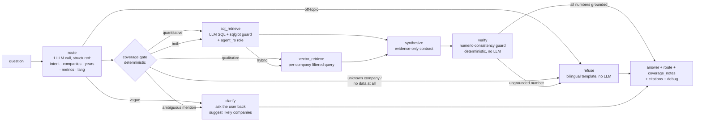

# Financial Q&A Chatbot — Implementation Plan (5 days × 5 h)

*(v2.5 — **intent gate + clarify path added to the agent**: route node now classifies question intent (financial / off-topic / vague) — off-topic gets a polite scope refusal, vague gets a clarifying question back to the user; company mentions are normalized via the LLM's own brand knowledge (world-knowledge entity resolution) with the alias table demoted to deterministic backstop — less manual alias config in production. Companion doc: `agent-output/technical-execution-plan.md` (code-level execution detail). v2.4 — **streaming promoted into v1** (SSE, AI SDK UI message stream protocol from FastAPI); frontend stack pinned: AI SDK `useChat` + shadcn/ui; Auth.js evaluated and rejected for v1 (custom FastAPI JWT stands — rationale in Auth §); template-inspired future improvements (AI SDK OTel telemetry, WebSocket transport, resumable streams). v2.3 — structured-output enforcement specified from verified July-2026 research (`agent-output/structured-output-research.md`): strict json_schema via `with_structured_output`, reasoning-first schema, in-node re-ask → fail-closed. v2.2 — folded in learnings from prior `spw_retail-rag` project (see `agent-output/spw-retail-rag-learnings.md` §A): DI app factory, numeric-consistency `verify` node promoted from future→Day 4, fail-closed routing, fixture-driven routing tests, `debug` payload, typed config knobs, optional compose seed profile. v2.1 — merged with Ultraplan cloud refinements: read-only `agent_ro` role, describe_index host resolution, metadata junk-key cleanup, boilerplate-chunk handling, graph diagram. Added: budget fallback, production-hardening roadmap)*

## Context

Take-home assignment (spec: `Take-Home Task.pdf`, summary: `CLAUDE.md`): build a locally-run financial Q&A chatbot web app where signed-in users ask questions grounded in two stores — PostgreSQL (income-statement data, 49 companies, 2022–2025) and Pinecone-local (4,072 embedded chunks from four FY2025 10-Ks: Alphabet, Amazon, Apple, Meta). Hard requirement: **no hallucination** — when data is unavailable, say so explicitly. Auth will be extended live in a follow-up interview session, so it must be clean and extensible. Deliverables: repo + docker-compose data stack + loaders + README + app answering 3 Thai baseline questions.

**Repo state (verified)**: greenfield — only `data/`, `10k_filings/`, `CLAUDE.md`, `.gitignore` (already covers `.env`, Python, Node, volumes), on `dev` branch. Everything below is new code.

**Confirmed stack (user decisions)**: FastAPI + LangGraph + OpenAI (provided key, $10 cap) · Next.js (App Router) frontend with **AI SDK `useChat` (client only) + shadcn/ui** · JWT + bcrypt auth (custom, FastAPI-side — Auth.js deliberately not used, see Auth §) · Postgres + pinecone-local via Docker Compose · **streaming responses in v1** (SSE). Work on `dev`, conventional commits.

## Verified data facts

- **SQL**: `financial_data(company, ticker, sector, year, revenue, net_income, operating_income, gross_profit)` — 192 rows, 49 companies. Dump is `DROP TABLE IF EXISTS` + `COPY FROM stdin` → safe for initdb, re-runnable via `down -v`. Name quirks: DB says **"Google"/"Meta"**, questions say "Google"/**"Facebook"**, PDFs say **"Alphabet"**/"Meta" → alias layer required (incl. Thai names). Built-in refusal cases: **BlackRock 2022–23 only, Shopify 2024–25 only**, NULLs in some cells (e.g. Amazon `gross_profit` all `\N`).
- **Vectors**: exactly **4,072** records, dim **512** (`text-embedding-3-small`, cosine), namespace `__default__`, metadata `{text, page, page_label, source, title, total_pages, creator, producer, ...}`. `source` is an absolute macOS path — loader must derive a clean `company` metadata field from the filename and **drop junk keys** (`creator`, `producer`, `moddate`, `creationdate`). Per-company counts: Meta 1568, Alphabet 1052, Amazon 848, Apple 604 (skew → query per company with metadata filter, not one global top-k). **Chunk text contains print-to-PDF noise** (page-header lines like `4/20/26, 12:05 PM goog-20251231 file:///...`) — expect low-value chunks; rely on score floor + synthesis prompt that ignores boilerplate.
- **Ground truth for eval** (computed from `data/financial_data.sql`): Apple net income 2022–25 = 99,803 / 96,995 / 93,736 / 112,010 ($M). Revenue growth 2024→25: **Meta +22.2%** (winner, has 10-K → "why" groundable), Google +15.1%, Microsoft +14.9% (**no 10-K → "why" must be flagged ungroundable**), Apple +6.4%.
- **Pinecone-local**: image `ghcr.io/pinecone-io/pinecone-local:latest`, control plane :5080, each index gets a port in 5081–5090 (publish the whole range), env `PINECONE_HOST=localhost`. SDK: `Pinecone(api_key="pclocal", host="http://localhost:5080")` for control plane; after `create_index`, **`describe_index(...).host` gives the data-plane host:port to pass to `pc.Index(host=...)`** — loader and `vector_tool` must both resolve the host this way, never hardcode 5081. **No persistence across restarts** → loader idempotent (create-if-missing, upsert by stable ids), re-run after every `docker compose up`; health endpoint must detect an empty index.

## Repo layout

```
docker-compose.yml          # postgres:16-alpine + pinecone-local (DBs only; apps run on host)
.env.example                # OPENAI_API_KEY, JWT_SECRET, DATABASE_URL, PINECONE_HOST
Makefile                    # up / seed / api / web / eval / down
scripts/
  initdb/
    01_financial_data.sql   # compose mount of data/financial_data.sql
    02_roles.sql            # CREATE ROLE agent_ro; GRANT SELECT ON financial_data ONLY
  load_pinecone.py          # gzip-stream → batch upsert (200/batch), create_index if missing,
                            #   resolve data-plane host via describe_index, normalize metadata
                            #   (source path → company, drop junk keys), assert count==4072
  eval_baseline.py          # integration eval: Q1-Q3 (Thai) + refusal probes vs /api/chat
backend/
  pyproject.toml            # uv: fastapi, sqlalchemy, psycopg, pyjwt, bcrypt, pinecone,
                            #   openai, langgraph, langchain-openai>=0.3 (json_schema is
                            #   the default with_structured_output method there),
                            #   sqlglot, pytest
  app/
    main.py                 # create_app() factory — real clients wired in lifespan only;
                            #   tests inject stubs (offline, $0 test runs)
    config.py               # pydantic-settings; every tuning knob (score floor, top_k,
                            #   model names, agent_ro DSN) typed + env-configurable
    db.py
    auth/    models.py · service.py (pure fns, no FastAPI imports) · deps.py (get_current_user,
             require_role stub) · router.py (/api/auth/register|login|me)
    chat/    router.py (POST /api/chat, auth-guarded) · schemas.py
    agent/   state.py · graph.py (build_graph(sql_tool, vector_tool, llm) — clients
             injected, no module singletons) · coverage.py (alias table + coverage map)
             nodes/ (route, sql_retrieve, vector_retrieve, synthesize, verify, refuse, clarify)
             sql_tool.py · vector_tool.py
    clients/ openai_client.py · pinecone_client.py
  tests/     test_auth, test_coverage, test_sql_validator, test_router, test_verify
             fixtures/routing_cases.json   # golden routing/coverage cases (Thai + English)
frontend/                   # Next.js App Router + TS + Tailwind + shadcn/ui
  app/{login,register,chat}/page.tsx
  components/ui/            # shadcn/ui primitives (button, input, card, badge, collapsible, table)
  components/{AuthForm,ChatWindow,MessageBubble,RouteBadge,CitationList}.tsx
                            # ChatWindow = AI SDK useChat (DefaultChatTransport → FastAPI /api/chat,
                            #   Authorization header injected); custom data parts drive
                            #   RouteBadge/CitationList/verify status
  lib/{api.ts,auth.ts}      # bearer fetch wrapper, 401 → login redirect
```

Postgres loads via `/docker-entrypoint-initdb.d/` (dump verified compatible). Users table lives in the same DB but the agent's SQL tool connects as **`agent_ro`, which has SELECT on `financial_data` only — the LLM-generated-SQL path physically cannot read `users`**.

## Agent design (no-hallucination core)



1. **route** — one temp-0 LLM call, structured output: **classify intent (`financial` / `off_topic` / `vague`)** + extract companies/years/metrics + proposed route + answer language. **Intent gate (scope guardrail)**: `off_topic` (not about company financials or 10-K content — recipes, code, general chit-chat) → polite scope refusal in the user's language, stating what the bot *can* do; `vague` (financial-ish but underspecified — "how's the company doing?") → **`clarify` route**: the bot asks a targeted question back instead of guessing (the clarifying question is generated in the same route call, e.g. "Which company do you mean? I have data for Apple, Google, Meta, Microsoft…"). **World-knowledge entity resolution**: the prompt instructs the model to normalize company mentions to canonical official names using its own brand knowledge ("บริษัทที่ทำ iPhone" → Apple, "IG's parent" → Meta, "Facebook" → Meta) — this is what makes the system less manual-config in production: the alias table (Thai + English + Facebook→Meta, Alphabet→Google) is demoted to a deterministic backstop + regression-test anchor rather than an exhaustively hand-maintained list. Mentions the LLM can't confidently resolve → `clarify` with its best-guess candidates offered to the user, never a silent guess. **Enforcement (verified best practice, see `structured-output-research.md`)**: Pydantic `RouteDecision` with `reasoning: str` as the **first** field (schema field order = generation order; officially endorsed for gpt-4o-mini-class), `route: Literal["sql","vector","both","refuse"]`, `field_validator`s for domain constraints (years, non-empty language); bound via `with_structured_output(RouteDecision, method="json_schema", strict=True, include_raw=True)` — strict server-side constrained decoding, and `include_raw` surfaces `parsing_error` instead of crashing the node. Strict mode guarantees *syntax only* — refusals (`message.refusal`) and `max_tokens` truncation still yield `parsed=None`. **Fail-closed**: `parsing_error`/`parsed is None` → one re-ask appending the validation-error text → second failure → route to refuse ("couldn't process the question" template), never to a guessed retrieval path. LangGraph `RetryPolicy` reserved for transient network errors only; semantic retries stay in-node where the error text can be fed back.
2. **coverage gate (deterministic, `coverage.py`)** — built at startup from `SELECT company, array_agg(year)` + static vector-availability set {Apple, Amazon, Google, Meta}. Downgrades routes and emits coverage notes: unknown company → refuse; years out of range → trim + note; hybrid where company lacks 10-K (Microsoft) → note "qualitative 'why' cannot be grounded", SQL half still runs.
3. **sql_retrieve** — LLM-generated SQL with three guards: `agent_ro` Postgres role, sqlglot validation (single SELECT, only `financial_data`, LIMIT ≤ 100), one retry then "evidence unavailable". Growth % computed in Python from returned rows, never by the LLM.
4. **vector_retrieve** — embed query (`text-embedding-3-small`, dims=512), query **per company** with `company` metadata filter, top_k≈6 each, score floor ~0.25 (tune Day 3 against the known boilerplate chunks); empty → insufficient-evidence flag.
5. **synthesize** — strict evidence-only contract: quantitative claims from SQL rows only, qualitative claims cited `[Source, p.N]`, ignore page-header boilerplate in chunks, reproduce coverage notes verbatim, answer in the question's language; empty evidence → refusal. Output is a structured envelope `{answer, citations[]}` via the same `with_structured_output(..., strict=True, include_raw=True)` mechanism — the verify node and `CitationList` need machine-readable citations anyway; same one-re-ask-then-refuse policy. Schema note: strict mode requires all fields `required` (absence = `Optional[X]` null-union) and bans open `dict[str, X]` fields — design both schemas accordingly.
6. **verify (deterministic, no LLM)** — regex-extract every number from the draft answer and assert each appears in the SQL rows or cited chunk text (formatting/rounding variants allowed: commas, $, %, one-decimal rounding). Failure → one regenerate with the offending numbers flagged, then degrade to partial answer/refusal — **replace the answer, never annotate it**. Pattern proven in the prior retail-RAG project (`output_guard.py` veto flow); zero API cost.
7. **refuse** — deterministic bilingual template, no LLM. Two template families: *data-unavailable* (existing) and *out-of-scope* (new, for the intent gate): polite, states the bot's purpose and gives 2–3 example questions it can answer.
8. **clarify (terminal node, no retrieval)** — streams the route node's clarifying question as the assistant message (`data-route` carries `route:"clarify"`); the user's reply arrives as the next turn with full history, so no session state is needed. Covers both vague intent and ambiguous company mentions (offering the LLM's best-guess candidates: "Did you mean Meta (Facebook)?"). Skips verify (no factual claims to check).

Models: gpt-4o-mini-class for route+synthesis, temp 0, capped tokens; est. <$2 of $10 budget. Record fixtures so test reruns cost $0. **Budget fallback**: if the provided key's $10 cap is hit, swap `OPENAI_API_KEY` in `.env` to the developer's personal OpenAI account — no code change needed since the key is injected purely via environment config.

## API + frontend

- `POST /api/chat` `{message, history?}` → **SSE stream in v1**, speaking the [AI SDK UI message stream protocol](https://ai-sdk.dev/docs/ai-sdk-ui/stream-protocol) (`Content-Type: text/event-stream` + `x-vercel-ai-ui-message-stream: v1` header) so the frontend is just `useChat` with a `DefaultChatTransport` pointed at FastAPI — no hand-rolled SSE parsing. Stream sequence:
  1. **custom data parts** as the graph progresses: `data-route` (router decision → RouteBadge appears immediately), `data-coverage` (coverage notes), `data-citations` (retrieved chunks/SQL as soon as retrieval lands);
  2. **text deltas** from the `synthesize` node (LangGraph `astream_events` → token stream), rendered live but styled *provisional*;
  3. **`data-verify`** after the deterministic verify node runs on the completed text: `{ok: true}` → UI marks the message verified; `{ok: false}` → UI **replaces** the streamed text with the refusal/partial template (guard still binds — streaming shows the draft, verify has final say; this stream-then-veto tension and its resolution is a deliberate, defensible design point);
  4. `finish` with message metadata: `route, coverage_notes, citations, debug`.
  `debug` = the router's structured extraction, SQL emitted, per-company vector scores **including below-floor rejects**, verify-node result — all data already in graph state, ~free to expose. Turns Day-3 score-floor tuning into reading a JSON field and makes routing/refusals demoable ("here's exactly why it refused"). Always-on for v1.
- Transport choice: **SSE, not WebSocket** — unidirectional server→client fits chat responses, works over plain HTTP with the existing `Authorization` header (WebSocket auth requires token-in-query or subprotocol workarounds), auto-reconnect is native, and the AI SDK protocol standardizes on SSE. WebSocket upgrade = future improvement (§5) if bidirectional needs appear (typing indicators, collaborative sessions).
- `GET /api/health` → `{postgres_rows, vector_count, ok}` — catches pinecone-empty-after-restart; chat responds "run `make seed`" instead of answering wrong.
- Frontend: login/register (shared `AuthForm`), guarded `/chat`, `RouteBadge` (SQL / 10-K / Hybrid / Refused — makes routing demoable), collapsible `CitationList` (SQL rows as mini-table, chunks as source+page+snippet). Token in localStorage (trade-off in README; cookie migration = natural live-session task).

## Auth (live-session extension surface)

`users(id UUID PK, email UNIQUE, password_hash, display_name, role DEFAULT 'user', created_at)` via `create_all` (Alembic deferred deliberately). PyJWT HS256, 60-min expiry; `bcrypt` package directly (not passlib — unmaintained, breaks with bcrypt≥4). `service.py` = pure functions; `deps.py` = `get_current_user` + `require_role()` factory stub; auth module imports nothing from chat/agent.

**Why not Auth.js (NextAuth)** — evaluated against the Vercel chatbot template and rejected for v1: (1) it moves the auth authority into the Next.js server, but the resource being protected is the FastAPI API — we'd still need to mint/verify a FastAPI-consumable token, i.e. two auth surfaces instead of one; (2) the assignment says auth will be **extended live on this codebase** and "own your code" — ~80 lines of explicit PyJWT+bcrypt we can walk through line-by-line beats a framework abstraction we'd be explaining from docs; (3) Auth.js's strengths (OAuth provider zoo, session cookies, DB adapters) are exactly the things listed as future work, not v1 requirements. Auth.js/OAuth becomes attractive if social login is requested — noted in Future §5.

## Day-by-day (25 h)

| Day | Exit criterion | Work |
|---|---|---|
| 1 | `/api/health`: 192 rows + 4072 vectors | compose, initdb + roles, `load_pinecone.py` (incl. describe_index host resolution + metadata normalize), FastAPI skeleton as `create_app()` DI factory (clients wired in lifespan, injectable for offline tests) + pydantic-settings config. **Risk gate: pinecone-local quirks >1 h → fall back to `pinecone-index` image (fixed port, env-configured index)** |
| 2 | Browser login → protected **streaming** echo-chat | users table, register/login/me + JWT dep + tests; Next.js scaffold + shadcn/ui init, auth pages, chat shell with `useChat` against a **stub FastAPI SSE endpoint speaking the UI message stream protocol** (fake token deltas + one data part) — protocol risk retired on Day 2, before any LLM code exists |
| 3 | **Q1 + Q2 correct in Thai via curl** (streamed) | coverage map + aliases (fixture-driven tests: `routing_cases.json`), router incl. **intent gate (off-topic/vague/ambiguous-name → refuse/clarify)** and fail-closed error path (+test: malformed LLM output → refuse), SQL tool + validator (+tests), vector tool tuning (score floor vs boilerplate chunks — read from `debug` payload), graph wiring with `astream_events` token streaming into the Day-2 SSE endpoint, synthesis v1. Test Thai today, not Day 5 |
| 4 | **All 3 baselines + 3 refusal demos pass in UI** | hybrid path (Q3), `verify` node (numeric-consistency guard +test: fabricated number → veto) incl. **stream-veto flow** (`data-verify {ok:false}` → UI replaces provisional text), `debug` in finish metadata, refusal paths (BlackRock 2025, unknown company, Netflix-strategy-no-10K), citations/RouteBadge from data parts, error states |
| 5 | Fresh clone passes `eval_baseline.py` per README | README (setup, seed-after-restart caveat, architecture sketch), eval script, clean `down -v` → follow README verbatim; ~2 h buffer; stretch: message persistence, app containers, compose `--profile seed` one-shot job (one-command seeding without host Python env) |

## Verification

- **Unit (no API cost — all offline via `create_app()` stub injection)**: fixture-driven routing/coverage cases in `tests/fixtures/routing_cases.json` — each case `{question, expected_route, expected_companies, expected_years, expected_coverage_notes}`, covering Thai/English aliases (Facebook→Meta, Alphabet→Google), BlackRock/Shopify year edges, unknown companies, Microsoft-hybrid downgrade, **intent-gate cases (off-topic "write me a poem" → scope refusal; vague "how's the company doing?" → clarify; fuzzy mention "the iPhone company" → resolves to Apple; ambiguous mention → clarify with candidates)**; router fail-closed (malformed LLM output → refuse); verify node (fabricated number → veto, rounding variants pass); `RouteDecision`/synthesis-envelope schemas (field_validators reject out-of-range years, empty language; `parsed=None` → re-ask → refuse path, stubbed LLM); sqlglot validator rejects UPDATE/DROP/multi-statement/other tables (incl. `users`); JWT round-trip.
- **`scripts/eval_baseline.py`** (live stack): register user → post Thai Q1–Q3, **consuming the SSE stream and reassembling the final message** (so the eval also exercises the streaming protocol + verify flow end-to-end) → assert: Q1 all four Apple net-income figures, route=sql; Q2 route=vector, citations from both Alphabet and Meta sources with pages; Q3 route=hybrid, names Meta/Facebook ~22% (expected values recomputed from the SQL file at test time), Meta 10-K citation, Microsoft coverage note present. Refusal probes: BlackRock 2025 → explicit unavailable; Netflix 10-K strategy → qualitative refusal; Siemens → full refusal; **off-topic probe ("แนะนำร้านอาหารหน่อย") → polite scope refusal, route=refuse; vague probe ("บริษัทเป็นยังไงบ้าง") → route=clarify with a question back**; assert no fabricated numbers.
- Final: clean-machine dry run following README verbatim is Day-5 exit criterion.

## Future improvements — production-hardening roadmap

Out of scope for the 25 h build, but each is a deliberate next step with a clear seam in the v1 architecture. Grouped by concern; ⚡ = natural live-session extension (small, demoable on top of v1).

### 1. Deeper hallucination defenses (grounding beyond prompt discipline)

- **Post-generation faithfulness gate** — decompose the draft answer into atomic claims and verify each against the retrieved evidence (RAGAS-style faithfulness, or a lightweight NLI cross-encoder for entailment). Score < threshold → regenerate once, then degrade to partial answer/refusal. Turns "please don't hallucinate" (a prompt) into "you can't hallucinate" (a gate). Slots in as one extra LangGraph node after `synthesize`.
- ~~Deterministic numeric-consistency check~~ — **promoted into v1** (Day 4 `verify` node) after the prior retail-RAG project proved it's hours of work. Future extension: broaden beyond numbers to entity/date grounding, then to NLI-based claim entailment (next bullet).
- **Citation resolution check** ⚡ — validate that every `[Source, p.N]` marker resolves to an actually-retrieved chunk id before returning; dangling citations → strip claim or refuse. Prevents "confident citation of nothing".
- **Answer-with-abstention calibration** — track per-route confidence (retrieval scores, SQL row counts, faithfulness score) and tune explicit abstention thresholds on a golden set, so "I don't know" is a calibrated decision, not a vibe.
- **Self-corrective retrieval (CRAG/Self-RAG patterns)** — a retrieval-evaluator step grades chunk relevance before synthesis; low-grade → query rewriting (decomposition, HyDE) and one re-retrieval loop. LangGraph makes this a cycle in the existing graph rather than a rewrite.

### 2. Retrieval quality

- **Hybrid retrieval + reciprocal-rank fusion** — add BM25/full-text (Postgres `tsvector` — already have Postgres) alongside dense vectors, fuse with RRF. Dense-only retrieval misses exact-term matches (ticker symbols, "Item 1A", specific product names) that are common in financial questions.
- **Cross-encoder reranking** — rerank the fused top-30 down to top-6 with a reranker (bge-reranker-v2-m3 locally, or a hosted rerank API). Biggest single precision win available for chunk quality; directly mitigates the print-to-PDF boilerplate chunks.
- **Structure-aware re-ingestion** — replace fixed-size chunks with layout-aware parsing of the 10-Ks by section (Item 1 Business, Item 1A Risk Factors, Item 7 MD&A) using a document-parsing pipeline, storing `item_section` metadata for filtered retrieval ("risk factors" questions → Item 1A only). Also the proper fix for the boilerplate noise, at the source.
- **Small-to-big / parent-document retrieval** — match on fine-grained chunks, hand the synthesizer the enclosing section for fuller context without diluting match precision.

### 3. Text-to-SQL robustness

- **Semantic layer instead of raw SQL** — expose vetted, named metrics (`revenue_growth(company, y1, y2)`, `net_income_series(company)`) as typed tools; the LLM selects and parameterizes rather than free-writing SQL. Eliminates the SQL-injection/mis-aggregation surface entirely; the sqlglot validator remains as defense-in-depth for a long-tail raw-SQL escape hatch.
- **Execution sanity checks** ⚡ — `EXPLAIN` dry-run before execute; assert result-set shape matches the router's extracted intent (N companies × M years); statement timeout + row cap at the Postgres role level (`SET statement_timeout`).

### 4. Evaluation & observability (the production differentiator)

- **RAGAS regression suite in CI** — faithfulness, context precision/recall, answer relevance over a growing golden dataset (seeded from Q1–Q3 + refusal probes); releases gate on no-regression. Hallucination bugs become failing tests, not user reports.
- **Tracing & telemetry** — LangSmith or Langfuse (self-hosted) spans for every node: router decision, SQL emitted, chunks + scores, synthesis tokens, per-request cost. Every wrong answer becomes replayable and diagnosable. Frontend half (inspired by Vercel's [ai-chatbot-telemetry template](https://vercel.com/templates/next.js/ai-chatbot-telemetry)): OpenTelemetry instrumentation on the Next.js side, propagating `traceparent` headers through `/api/chat` so one trace spans browser → FastAPI → every LangGraph node → OpenAI — a single distributed trace per question is the strongest possible observability demo.
- **Online groundedness scoring** — sample N% of production answers through the faithfulness evaluator asynchronously; alert on drift. Catches degradation from data updates or model version bumps.
- **Semantic caching** — cache (question-embedding → answer) pairs with a similarity threshold; big cost/latency win for repeated demo questions, with cache invalidation keyed to data-load version.

### 5. Security & platform hardening

- **Prompt-injection defense for retrieved text** — 10-K chunks are untrusted input; wrap evidence in delimited data blocks the system prompt marks as non-instructions (spotlighting), and strip/flag instruction-like content at load time. RAG pipelines that skip this are one poisoned document away from exfiltration.
- **Auth hardening** ⚡ — refresh-token rotation, httpOnly SameSite cookies (replacing localStorage), rate limiting on login + chat, `require_role` RBAC enforcement on admin endpoints (the stub already exists in `deps.py`). If social login is requested: Auth.js on the Next.js side as OAuth broker, exchanging its session for a FastAPI-minted JWT — keeps the API's auth authority where it is today.
- **Streaming transport upgrades** — (a) **WebSocket transport** (per Vercel's [FastAPI WebSocket template](https://vercel.com/templates/next.js/fastapi-ai-chat-with-websocket)): bidirectional channel enabling mid-generation cancel, typing indicators, multi-tab sync; AI SDK `useChat` supports custom transports, so it's a transport swap, not a rewrite. (b) **Resumable streams** — persist stream state (Redis/Postgres) keyed by message id so a dropped connection resumes mid-answer instead of re-asking (and re-paying for) the question; pairs with message persistence.
- **Migrations & ops** — Alembic migrations (replacing `create_all`), structured JSON logging, `/readyz` vs `/livez` split, app containers with multi-stage builds + compose `profiles`, secrets via Docker secrets rather than `.env`.
- **Output-contract enforcement** — ~~pydantic-validated response schema on every LLM output with re-ask~~ **in v1** (strict json_schema + in-node re-ask on both LLM nodes). Remaining future work: declarative policy layer (NeMo Guardrails / Guardrails AI) on top of the structural guarantee; LangChain 1.x `create_agent` with `ToolStrategy(handle_errors=...)` if the hand-rolled graph is ever swapped for the prebuilt agent; Responses API migration (`use_responses_api`) for better prompt caching.

**Suggested sequencing** (impact ÷ effort): citation resolution check (hours; numeric check already in v1) → hybrid retrieval + reranker (a day) → RAGAS CI suite + tracing (a day) → faithfulness gate (a day) → semantic layer, structure-aware re-ingestioGoon, ops hardening (a week+).
